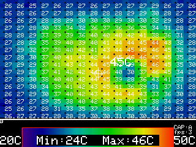

# M5Stack MLX90640
App for M5Stack ThemalCamera(MLX90640) 

English | [日本語](docs/getting_started_ja.md)

# Overview
Visualize the temperature distribution using the M5Stack thermal camera unit.
This program is based on the following M5Stack Example and added a function to save screenshots to an SD card.

[M5Stack Example MLX90640](https://github.com/m5stack/M5Stack/tree/master/examples/Unit/MLX90640)

This app is not completed yet. Please understand that point.

# Enviroment
- Arduino IDE 1.8.10
- Arduino-esp32 1.0.4
- [ESP32-Chmera-Core ](https://github.com/tobozo/ESP32-Chimera-Core)※１
- M5StackUpdater

※１．The ESP32ChimeraCore library cannot coexist with the M5Stack library. It is recommended to build another environment using the portable version of ArduinoIDE.
# InitialSetting before build
Edit MLX90640.ino and set the following items. Build after setting.
- WiFi SSID and Passphrase
- ntpServer's URL

# Usage
- Take ScreenShot(BtnB) 
- Change ScreenShot Mode 
BtnA: Auto / Manual  
AutoMode:By default, screenshots are taken once every 15 seconds.
- Reset Range(BtnA + BtnC) 
Resets the upper and lower values of the color bar.
- Change Lower value(BtnA long press)
- Change Upper value(BtnC long press)

# Known Issue
When using with M5Stack Fire, if you enable PSRAM, it may not work. In that case, please build after changing PSRAM disable.

# Other
The M5Stack library does not currently implement the ScreenShot function. Therefore, it is necessary to use ESP32ChimeraCore.

# Credits

- [@M5Stack](https://github.com/m5stack)
- [@tobozo](https://github.com/tobozo)
- [@lovyan03](https://github.com/lobyan03)

# Licence
[MIT](LICENSE)

# Author
[Takao Akaki](https://twitter.com/mongonta555)
