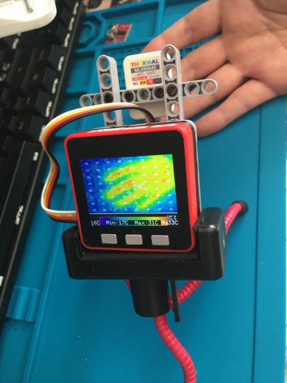
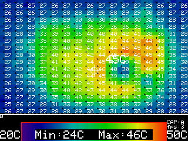

# M5Stack MLX90640
App for M5Stack ThemalCamera(MLX90640) 

[English](../README.md) | 日本語

# 概要
M5Stackのサーマルカメラユニットを利用して、温度分布を可視化するアプリケーションです。M5StackのExampleをベースにスクリーンショットをSDカードに保存できるようにしました。

[M5Stack Example MLX90640](https://github.com/m5stack/M5Stack/tree/master/examples/Unit/MLX90640)

このアプリはまだ作成途中なので、その点はご了承ください。

# Enviroment
- Arduino IDE 1.8.10
- Arduino-esp32 1.0.4
- [ESP32-Chmera-Core ](https://github.com/tobozo/ESP32-Chimera-Core)※１
- M5StackUpdater

※１．ESP32-Chimera-CoreはM5Stackライブラリと共存できません。ArduinoIDEのポータブル版を利用して別環境を使ったほうがいいです。

# ビルド前の初期設定
MLX90640.inoのInitial Settingsエリアの下記項目を変更してからビルドしてください。
- WiFi SSID and Passphrase
- ntpServer's URL

# 使い方
- スクリーンショットを取る(BtnB) 
- スクリーンショットモードを変更(BtnA) 
Auto / Manual  
AutoMode:スクリーンショットを15秒間隔で自動で保存するようになります。
- レンジのリセット(BtnB 長押し 3秒) 
カラーバーの上限値と下限値をリセット（20℃~50℃）にリセットします。
- カラーバー下限値の変更(BtnA長押し)
- カラーバー上限値の変更(BtnC長押し)
- カラーバーのアジャスト(BtnA + BtnC)

# 既知の不具合
ビルドする時にM5Stack FireのPSRAMをEnableにすると動作しないことがあります。PSRAMはDisableにしてビルドしなおしてください。

# その他
2019/12/1時点でM5StackライブラリはScreenShot機能を実装していないため、tobozo氏のESP32ChimeraCoreが必要です。

M5Stackライブラリにもきっと実装されるはず、、、

# Credits
- [@M5Stack](https://github.com/m5stack)
- [@tobozo](https://github.com/tobozo)
- [@lovyan03](https://github.com/lobyan03)

# Licence
[MIT](LICENSE)

# Author
[Takao Akaki](https://twitter.com/mongonta555)
